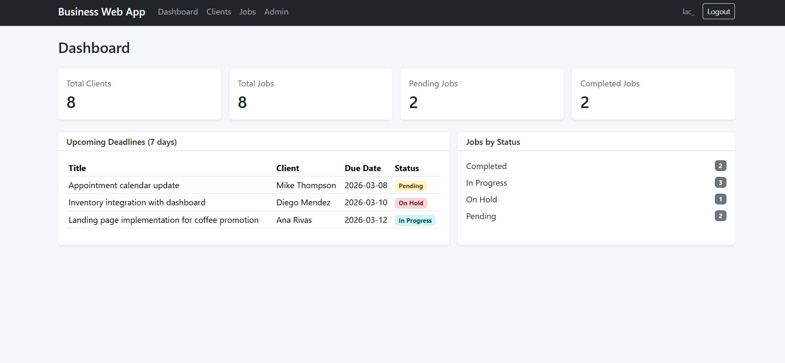
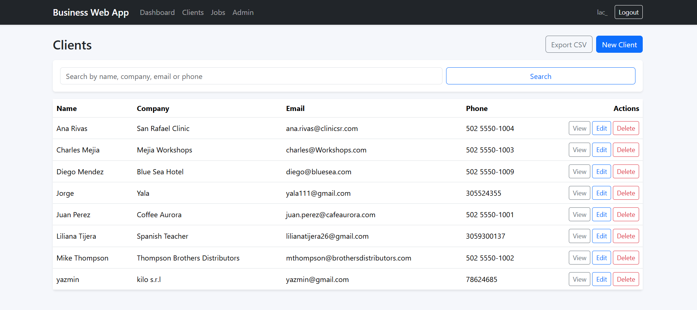
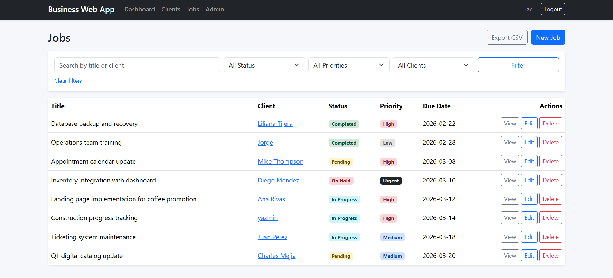

# 🏢 Business Web Manager

> Django web application for managing internal business workflows including clients, jobs, priorities, and operational metrics.

  
  
  

---

## ✨ Overview

Business Web Manager is a Django-based web application designed to manage internal operational workflows for small teams and businesses.

The platform centralizes **client management, job tracking, task prioritization, and operational metrics** within a single dashboard interface. Users can create and manage clients, assign jobs with priorities and due dates, track job status, and monitor operational activity from a unified control panel.

The project demonstrates practical web development patterns commonly used in real-world business applications, including:

- modular Django app architecture
- authentication and protected routes
- CRUD-based business workflows
- server-side filtering and search
- CSV data export
- dashboard metrics for operational visibility

This repository is designed as a **portfolio-ready Django application that models real internal business software workflows**.

---

# 🎬 Demo

A quick overview of how the system works.

https://youtu.be/yuOwXCc5wq4

---

## 📸 Example

### 📊 Dashboard

Central dashboard displaying operational metrics such as total clients, job counts, and upcoming deadlines.

---

### 👥 Client Management

Clients can be created, edited, searched, and deleted through a clean CRUD interface.

---

### 📋 Job Management

Jobs are linked to clients and include:

- title
- status
- priority
- due date
- description
- internal notes

Overdue jobs are visually highlighted when not completed.

---

## ⚡ Quick Start

Clone the repository:

    git clone https://github.com/Lautarocuello98/business-web-app.git

Move into the project directory:

    cd business-web-app

Create a virtual environment:

    python -m venv .venv

Activate the virtual environment (PowerShell):

    .\.venv\Scripts\Activate.ps1

Install dependencies:

    pip install -r requirements.txt

Run database migrations:

    python manage.py migrate

Create an admin user:

    python manage.py createsuperuser

Start the development server:

    python manage.py runserver

Open in your browser:

    http://127.0.0.1:8000/

---

## 🚀 Features

| Feature | Description |
|-------|-------------|
| Authentication | Login/logout with protected routes |
| Dashboard Metrics | Overview of clients, jobs, and operational statistics |
| Client Management | Full CRUD operations with search and pagination |
| Job Management | Full CRUD with status, priority, and due dates |
| Job Filtering | Filter jobs by text, status, priority, or client |
| CSV Export | Export filtered client and job lists to CSV |
| Overdue Highlighting | Visual alert for overdue jobs |
| Admin Console | Django admin with search and filtering |

---

## 🏗 Architecture

### Application Structure

    business-web-app/
    |
    |-- config/                          # Project configuration and root routing
    |   |-- __init__.py
    |   |-- asgi.py
    |   |-- settings.py
    |   |-- urls.py
    |   `-- wsgi.py
    |
    |-- core/                            # Home and dashboard views
    |   |-- views.py
    |   |-- urls.py
    |   `-- templates/core/
    |
    |-- clients/                         # Client management module
    |   |-- models.py
    |   |-- views.py
    |   |-- forms.py
    |   |-- admin.py
    |   |-- urls.py
    |   `-- templates/clients/
    |
    |-- jobs/                            # Job/task management module
    |   |-- models.py
    |   |-- views.py
    |   |-- forms.py
    |   |-- admin.py
    |   |-- urls.py
    |   `-- templates/jobs/
    |
    |-- users/                           # Authentication routes
    |   |-- forms.py
    |   |-- urls.py
    |   `-- templates/registration/
    |
    |-- templates/
    |   `-- base.html                    # Shared layout
    |
    |-- static/
    |   |-- css/
    |   `-- js/
    |
    |-- manage.py
    |-- requirements.txt
    |-- LICENSE
    `-- README.md

---

### Application Modules

The project is organized using a modular Django structure.

**core**

- dashboard views
- homepage

**clients**

- client data model
- client CRUD operations
- search and pagination

**jobs**

- job/task management
- priority and status tracking
- due date management
- job filtering

**users**

- authentication routes
- login/logout templates

This modular architecture keeps **business domains isolated**, improving maintainability and scalability.

---

## ▶️ Usage

Run the development server:

    python manage.py runserver

Create a superuser:

    python manage.py createsuperuser

Run tests:

    python manage.py test

Check project configuration:

    python manage.py check

---

## 🧠 Key Concepts Demonstrated

- Modular Django application architecture
- Class-based views for CRUD operations
- Server-side filtering and search
- Relational data modeling with Django ORM
- Authentication and protected views
- Exporting data to CSV
- Clean separation of business domains

---

## 🧰 Tech Stack

- Python
- Django
- SQLite
- Bootstrap 5
- HTML / CSS
- Django Templates

---

## 📄 License

This project is licensed under the **MIT License**.

See LICENSE for details.

---

## 👨‍💻 Author

Lautaro Cuello

GitHub  
https://github.com/Lautarocuello98

LinkedIn  
https://www.linkedin.com/in/lautaro-cuello-7ba4063a3/

---

⭐ If you found this project useful, consider giving the repository a star.
